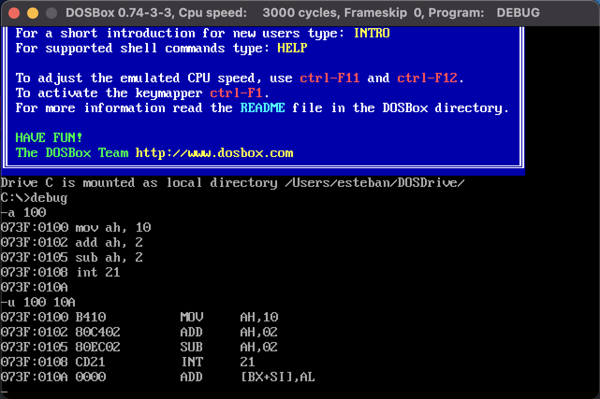

# DEBUG.EXE

La interfaz de línea de comandos (CLI), `debug` se utiliza para inspeccionar la
memoria y los registros del sistema.

## Índice de Comandos

- [Cambiar Dirección `-a`](#cambiar-dirección)
  - [Escribiendo Assembler](#escribiendo-assembler)
- [Calculo Suma/Resta de Números Hexa `-h`](#calcular-suma-y-resta-de-2-números-hexadecimales)

Para inicializarla se debe ejecutar la aplicación `debug`, la aplicación
funciona mediante comandos, se puede utilizar el comando _help_ escribiendo
<kbd>?</kbd> seguido de <kbd>Enter</kbd>.

<div style="padding: 1rem">
  
</div>

> Para cada comando se debe de ingresar la opción seguida de `Enter`.

> Para cerrar la aplicación se ingresa la opción `q` seguida de `Enter`

## Cambiar Dirección

```
-a [address]
```

El comando `a` se utiliza para cambiar la dirección a la que se quiere apuntar
el `debug`.

Se debe escribir `a` seguido de la dirección en memoria al que se quiere
inspeccionar.

```
-a 100
```

### Escribiendo Assembler (Ensamblar)

Se pueden escribir instrucciones en assembler cuando se ejecuta el comando
`address` (`a`).

```
-a 100
073F:0100 mov dx, 0000              ;; asigna 0 al registro DX
073F:0103 mov ah, 09                ;; establece justo a la siguiente instrucción 
073F:0105 int 21                    ;; que se escribira un mensaje en la pantalla
073F:0107 mov ax, 4c00              ;; finaliza el programa con codigo 0
073F:010A int 21                    ;; escribe un string a la salida standard (stdout)
073F:010C                           ;; finaliza sin ingresar mas instrucciones y presionando enter
-e 010C "Hello World!" 0d 0a "$"    ;; ingresa el string "Hello World!" en el espacio de memoria 010C
-a 100
073F:0100 mov dx, 10c0              ;; mueve el dato en `010C` a el registro `dx`
073F:0103
-d 100                              ;; dump, muestra los contenidos en memoria para la dirección 100
```

> `0d` y `0a` son equivalentes a carriage return y line feed en assembly

> `"$"` determina que el string ha finalizado

<div style="padding: 1rem">
  
</div>

### El Segmento y el Desplazamiento

Cada intrucción que escribimos al hacer `-a` se escribe en un segmento
otorgado por el sistema operativo.

```
-a 100
073F:0100 mov dx, 0000
```

El segmento (`segment`), en este caso es `073F`. El mismo se verá en el
registro `CS`.

El Desplazamiento u `offset`, muestra el byte en memoria dentro del
segmento en el que se encuentra cada instrucción.

La forma en como se muestra ordenado es: `SEGMENT:OFFSET`.

## Desensamblar (`-u <OFFSET> <LIMIT>`)

El comando `u` nos permite desensamblar el código en binario, pasandolo a
assembler.

<div style="padding: 1rem">
  
</div>

### Modificar Instrucciónes en Memoria

Usando los comandos `-u` y `-a`, podemos modificar las intrucciónes que
escribimos anteriormente en memoria.

Podemos usar el comando `-u` pasando el rango del `offset` en el que se
encuentra nuestro programa.

```
-u 100 10c
```

Para ver las instrucciónes en este rango de memoria, luego usar el comando
`-a` pasando el `offset` que deseamos modificar.

```
-a 102
```

Colocamos el nuevo valor:

```
ADD AH, 08
```

Y finalmente volvemos a usar `-u` para confirmar que la instrucción se ha
actualizado satisfactoriamente.

<div style="padding: 1rem">
  
</div>


## Calcular Suma y Resta de 2 números hexadecimales

El comando `h` recibe como argumentos 2 números hexadecimales y calcula
la suma y la resta entre ambos numeros. Posteriormente los devuevele el
el orden, suma a la izquierda y resta a la derecha.

```
-h 123 100
0223 0023
```

## Registros (`-r` / `-r AX`)

El comando `r`, muestra el estado de los [registros](02_arch/02_registros.md).
Se puede utilizar de 2 formas.

1. Mostrar todos los registros `-r`
2. Mostrar 1 registo especifico `-r AX`

<div style="padding: 1rem">
  
</div>

Podemos usar `r` para cambiar el valor de un registro. Colocamos `r` seguido del
nombre del registro a cambiar el valor, sea `ax`, entonces `rax`.

Presionamos <key>Enter</key> y a continuación colocamos el valor.

```
-rax
AX 0000
: 100
```

Al ejecutar `r` de vuelta, veremos el valor del registro `AX` cómo `100`

```
-r
AX=0100 BX=0000 CX=0000 DX=0000 SP=0OFD BP=0000 SI=0000 DI=0000
D5=073F ES=073F
55=073F
C$=073F
IP=0100
NU UP FI PL NZ MA PO NC
073F: 0100 B410
MOL
AH. 10
```

<div style="padding: 1rem">
  
</div>

Este comando resulta de utilidad para cambiar el Program Counter ó registro `IP`,
para colocarlo al inicio de nuestro programa.

## Trace (`t`)

Ejecuta la siguiente instrucción en el Program Counter (registro `IP`) y
muestra el estado de los registros, similar a el comando `r`.

<div style="padding: 1rem">
  
</div>

