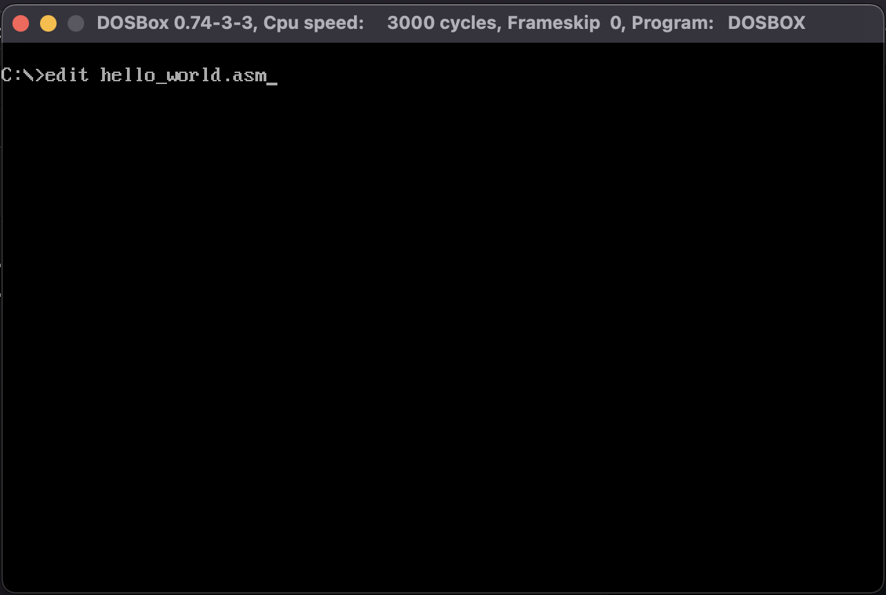
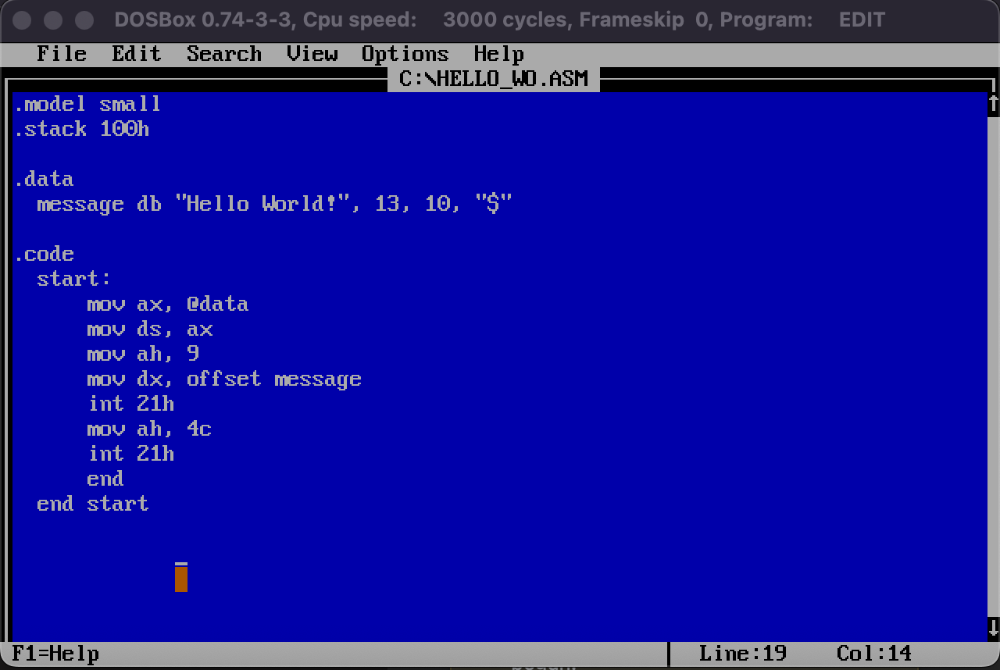
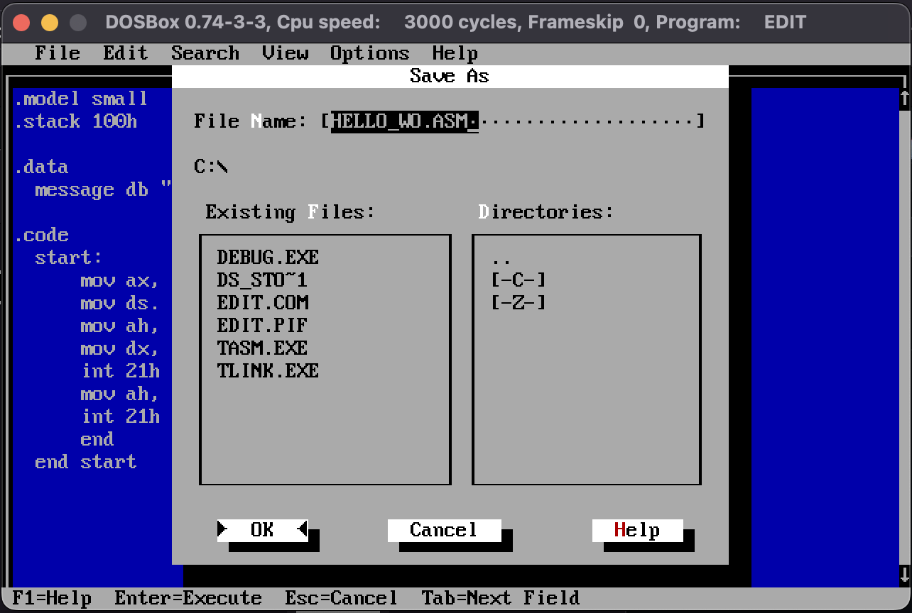
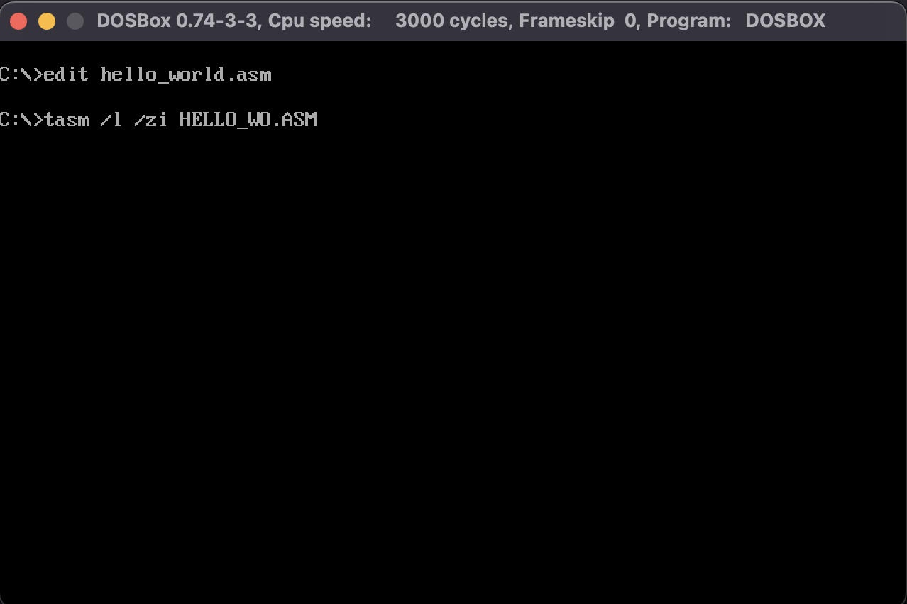
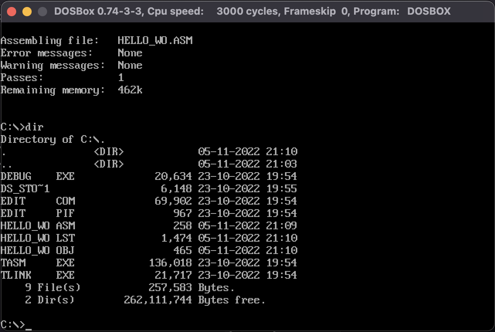
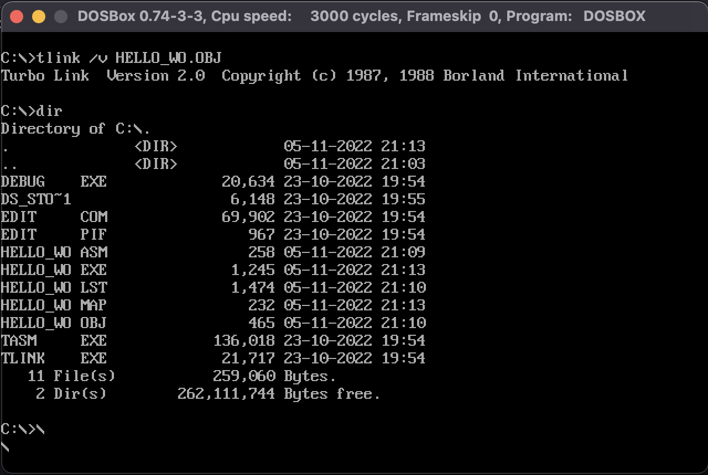
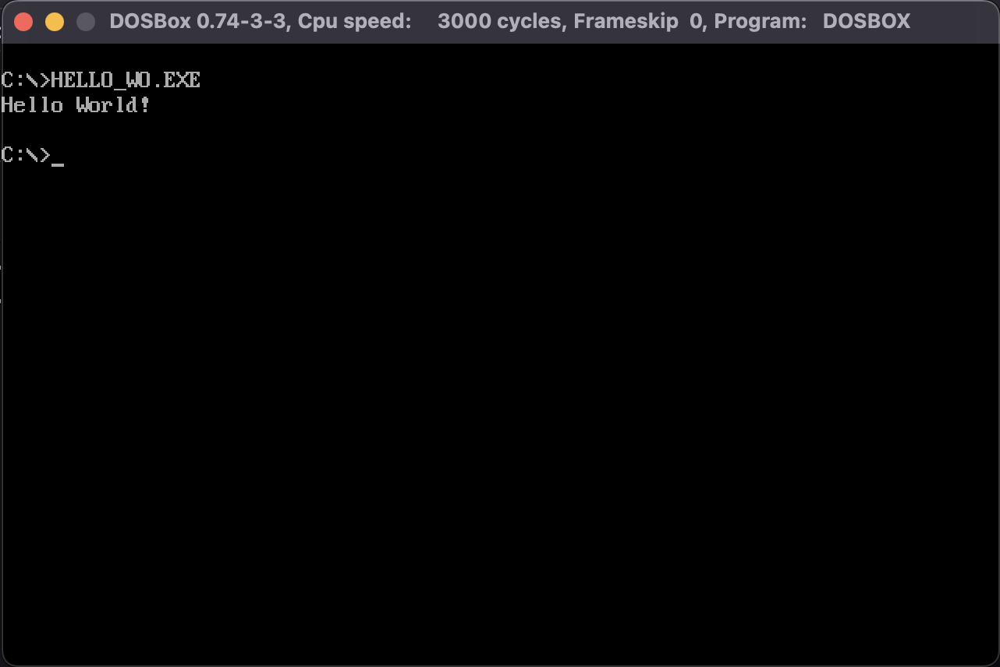

# EDIT.EXE

<div style="padding: 1rem">
  
</div>

El programa `EDIT.EXE` es un editor de texto, útil para el desarrollo de
programas en Assembly dentro de DOSBox.

## Creando un programa usando el editor `EDIT.EXE`

Para editar un archivo o crear uno nuevo se debe ejecutar `EDIT.EXE`, pasando
el nombre del archivo como parámetro.

```
edit <filename>.asm
```

<div style="padding: 1rem">
  
</div>

Desarrolla el código en assembler:

<div style="padding: 1rem">
  
</div>

Guarda el archivo, usa el cursor para abrir el menú de archivo en la parte
superior y luego presiona click en la opción `Save As`, finalmente presiona `Ok`.

<div style="padding: 1rem">
  
</div>

Luego vuelve a abrir el menú `File` y selecciona `Exit`.

## Compilando el Programa

Ahora debemos compilar el archivo Assembler, para ello usamos el ejecutable
`tasm` de la siguiente forma:

```
tasm /l /zi <filename>.asm
```

<div style="padding: 1rem">
  
</div>

Este comando compilara y creara 2 archivos a partir del código fuente en
Assembly, `HELLO_WORLD.LST` Y `HELLO_WORLD.OBJ`.

<div style="padding: 1rem">
  
</div>

Con el archivo `OBJ` presente, podemos hacer el linking y la compilación para
obtener el archivo `EXE` que nos premite ejecutar el programa.

```
tlink /v <filename>.obj
```

<div style="padding: 1rem">
  
</div>

## Ejecutando el programa como binario `.exe`

Finalmente ejecutamos el programa.

<div style="padding: 1rem">
  
</div>
